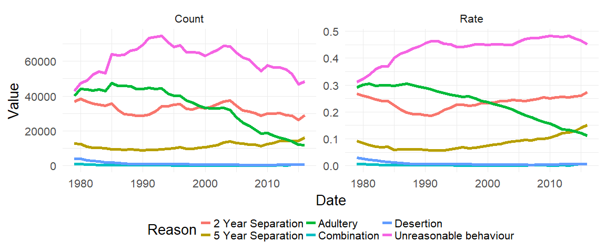
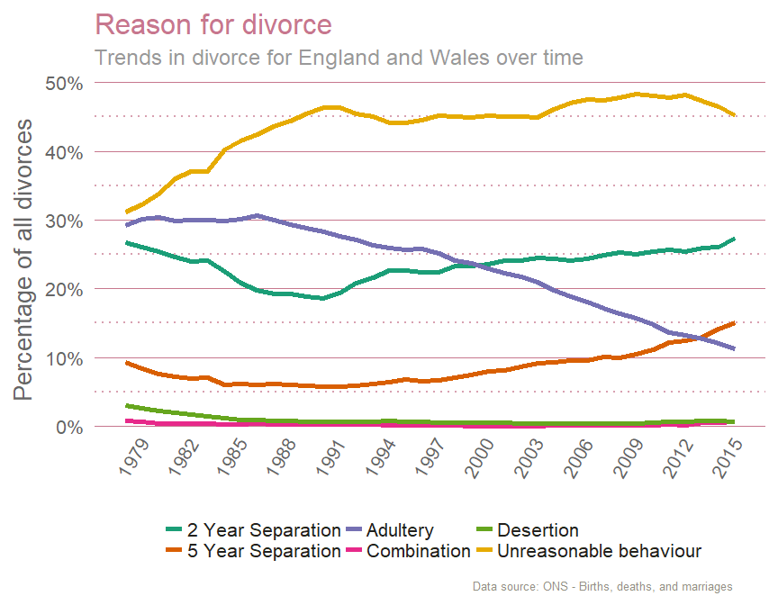

README
================
Andrew
24 January 2018

Divorce Data
============

This data was downloaded from [ONS](https://www.ons.gov.uk/peoplepopulationandcommunity/birthsdeathsandmarriages/divorce) and gives reasons for divorce in England and Wales in 2016.

The first thing to notice is that this data isn't normalised. Looking the raw count data, it may seem that certain reasons for divorce, such as 'unreasonable behaviour, are on the decline. However, as the total number of divorces (and marriages) are decreasing, the normalised data shows that 'unreasonable behaviour' is a stable reason for divorce over time.

``` r
# Test of Normalisation  --------------------------------------------------


NormCheck <- DivorceByReason %>%
  filter(PartyGranted == 'Both', Reason != 'All') %>% 
  ggplot(aes(x = Date, y = Value, colour = Reason)) +
  geom_line(size = 2) +
  theme_minimal(20)  +
  facet_wrap(~Analysis, scales = "free") +
  theme(legend.position = 'bottom') 

NormCheck
```



A Nicer Plot
------------

Now that we know we need the normalised data we can make a nicer chart.

``` r
# Plot of Proportions -----------------------------------------------------


ReasonRate <- DivorceByReason %>%
  filter(PartyGranted == 'Both', Reason != 'All', Analysis == 'Rate') %>% 
  ggplot(aes(x = Date, y = Value, colour = Reason)) +
  geom_line(size = 2) +
  theme_Warb(20) +
  scale_y_continuous(labels  = scales::percent) +
  scale_x_continuous( breaks = seq(1979, 2016, 3)) +
  labs(y = 'Percentage of all divorces',
       colour = "",
       caption = "Data source: ONS - Births, deaths, and marriages",
       title = "Reason for divorce",
       subtitle = "Trends in divorce for England and Wales over time") +
  scale_colour_brewer(palette = "Dark2")+
  theme(legend.position = 'bottom') 


ReasonRate
```


